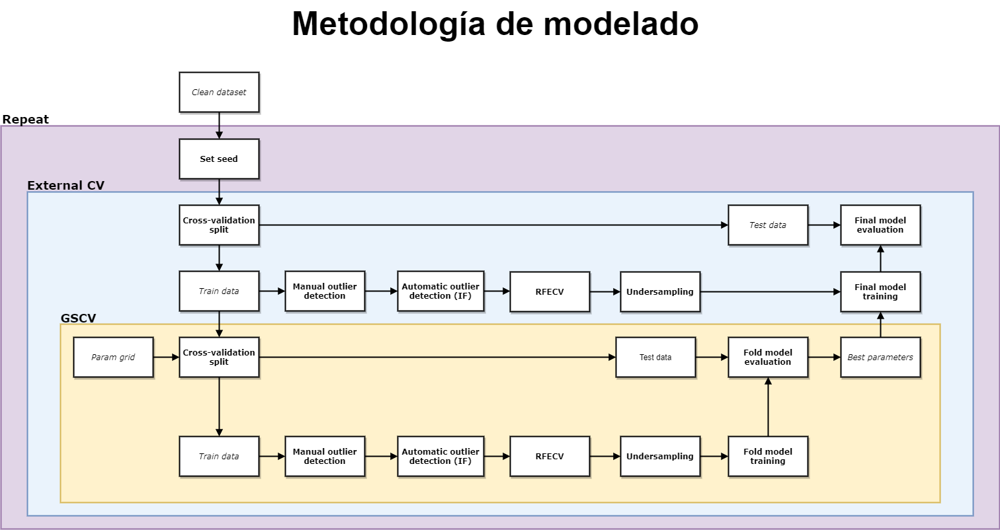
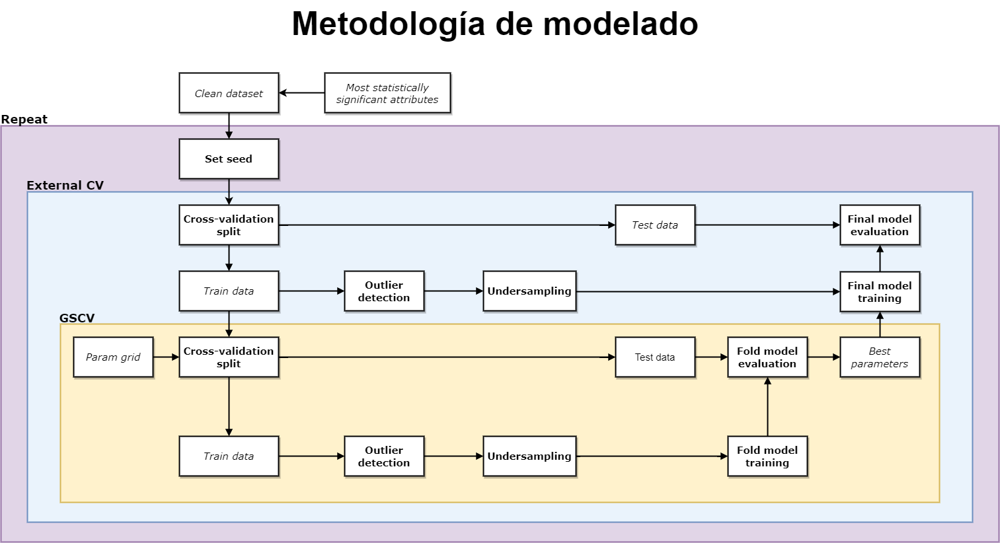

# Network anomaly detection

## Metodología original



## Metodología modificada para mejorar rendimiento



## Instalación
Con el objetivo de que el _dataset_ esté disponible se ha empleado [GIT LFS](https://git-lfs.github.com/). Para poder descargarlo con el repositorio es necesario tener instalado GIT LFS. Además, también hace falta, como se indica en la sección _Getting Started_ de su página de instalación, ejecutar el comando siguiente para inicializar GIT LFS:

```bash
git lfs install
```
Después el clomando `clone` de git ya debería incluir la descarga del dataset a partir del link que hay en el repositorio:

```bash
git clone
```

En caso de que no funcionase correctamente, se podría probar a ejecutar el siguiente comando. Es equivalente al `git clone` pero está deprecado:

```bash
git lfs clone
```
